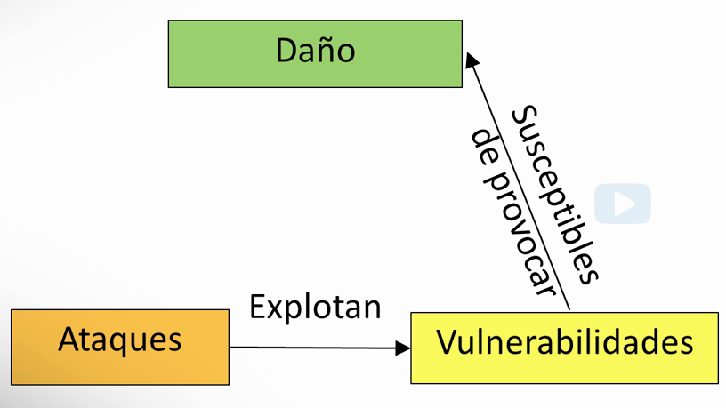
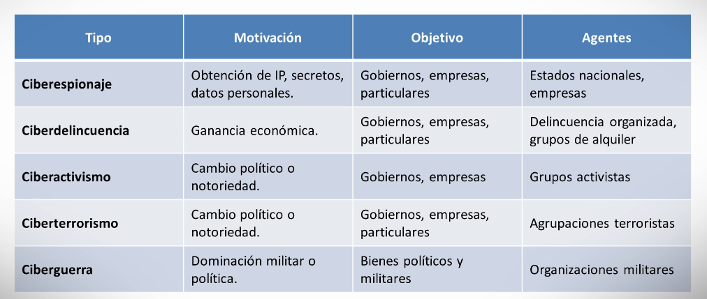
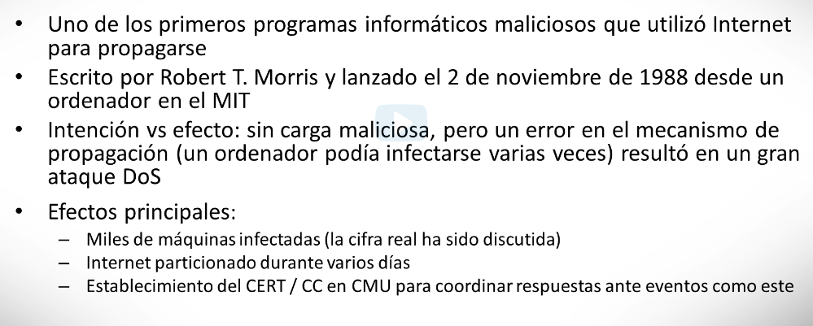
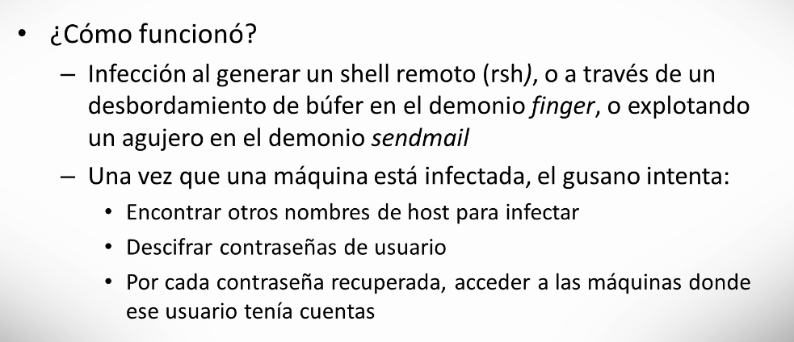
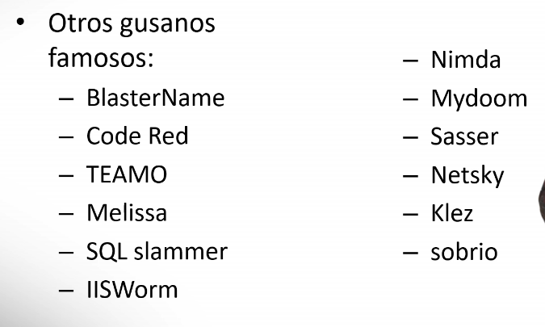
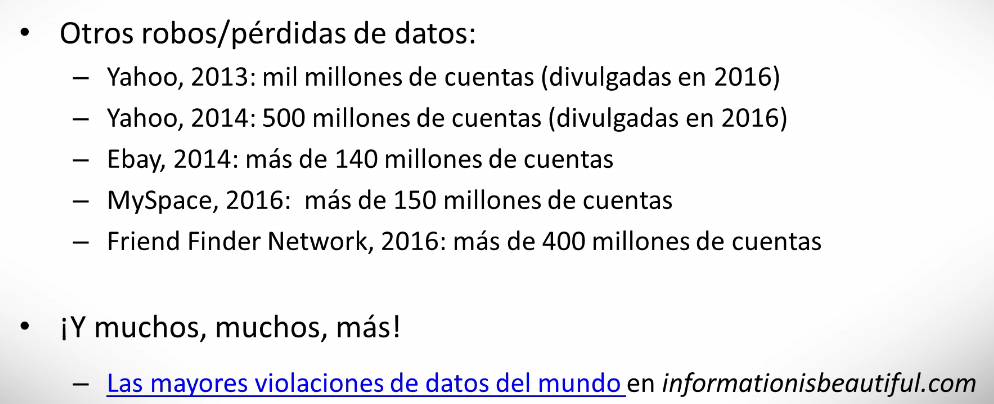
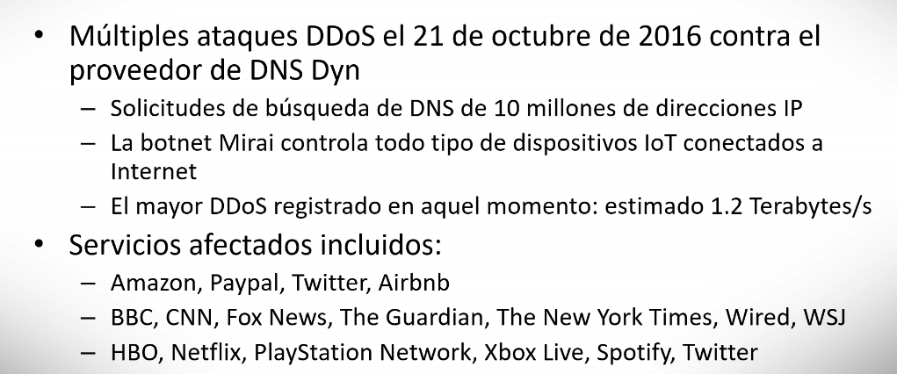
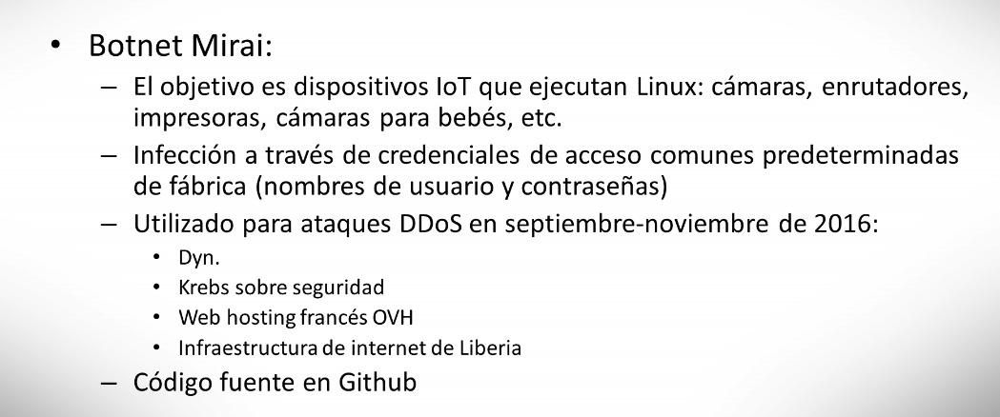

# Introducción a la Ciberseguridad

- [Introducción a la Ciberseguridad](#introducci%c3%b3n-a-la-ciberseguridad)
  - [Objetivos de la ciberseguridad y causas de los riesgos](#objetivos-de-la-ciberseguridad-y-causas-de-los-riesgos)
    - [Concepto de ciberdelito y de ciberseguridad](#concepto-de-ciberdelito-y-de-ciberseguridad)
    - [Tipos de medidas de seguridad](#tipos-de-medidas-de-seguridad)
  - [Ciberseguridad: una visión generaliza](#ciberseguridad-una-visi%c3%b3n-generaliza)
    - [Tipos de ataques y de actividades de cibercrimen populares](#tipos-de-ataques-y-de-actividades-de-cibercrimen-populares)
      - [Spam](#spam)
      - [Scareware - Ramsomware](#scareware---ramsomware)
      - [Fraude de Clicss](#fraude-de-clicss)
      - [Ataques contra sistemas de pago y banca electrónica](#ataques-contra-sistemas-de-pago-y-banca-electr%c3%b3nica)
    - [Ciberespionaje](#ciberespionaje)
  - [Ciberamenazas](#ciberamenazas)
    - [Estructura de las ciberamenazas](#estructura-de-las-ciberamenazas)
    - [Objetivos de las ciberamenazas](#objetivos-de-las-ciberamenazas)
    - [Elección de las víctimas](#elecci%c3%b3n-de-las-v%c3%adctimas)
    - [Origen del atacante](#origen-del-atacante)
    - [Incidentes históricos](#incidentes-hist%c3%b3ricos)
      - [El gusano de Morris 1988](#el-gusano-de-morris-1988)
      - [PlayStation Network Hack](#playstation-network-hack)
      - [Dyn DDoS](#dyn-ddos)
  - [Informática forense](#inform%c3%a1tica-forense)
    - [Evidencias digitales](#evidencias-digitales)
    - [Principales conceptos](#principales-conceptos)
    - [Recuperación de los datos](#recuperaci%c3%b3n-de-los-datos)
    - [Metadata](#metadata)
      - [Herramienta Exiftool](#herramienta-exiftool)
    - [Extensiones de fichero](#extensiones-de-fichero)
    - [Data carving](#data-carving)
    - [Análisis RAM](#an%c3%a1lisis-ram)
  - [Material adicional](#material-adicional)

En este tema, aboradaremos dos materias:

- Ciberseguridad: una visión general
- Informática forense

A lo largo de los recursos de aprendizaje tendrás una introducción al impacto que tiene la ciberseguridad en la actualidad, así como a los principales objetivos de la ciberseguridad y a los tipos de medidas de seguridad que se aplican, junto con ejemplos de ciberamenazas que siguen haciendo cada día más necesaria esta área de estudio. Además, abordaremos una técnica enfocada en la recogida, el análisis y la preservación de evidencias digitales, la informática forense.

Al finalizar estas dos lecciones te habrás capacitado para:

- Identificar los objetivos básicos de la ciberseguridad, algunas de las causas de los riesgos que comportan el uso de los sistemas y tipos de medidas de seguridad.
- Reconocer conceptos básicos y características de ciberseguridad, cibercrimen y ciberguerra, a partir de casos reales en la historia.
- Identificar las bases de la informática forense, con base en algunas de las herramientas más utilizadas en esta área.

## Objetivos de la ciberseguridad y causas de los riesgos

Desde hace poco más de 50 años asistimos a una revolución que nos ha introducido en la era de la información o, si se quiere, del conocimiento, y que está propiciada por el uso masivo de sistemas de información y redes de ordenadores, en adelante simplemente sistemas.

Sus rasgos distintivos son la rapidez con la que se ha extendido y la profundidad de los cambios que está provocando en la sociedad e incluso en la vida personal de los individuos. Por eso, dependemos críticamente de estos sistemas, de modo que su inoperatividad o malfuncionamiento, accidental o deliberado, comporta graves consecuencias, incluso para la sociedad en general, como sucede con las infraestructuras críticas que soportan, sin posibles alternativas, los servicios esenciales imprescindibles para el funcionamiento de la sociedad.

Por consiguiente, delincuentes de todo tipo tratan de hallar vulnerabilidades que, explotadas, les permita obtener beneficios económicos, políticos, propagandísticos o crear sensaciones de inseguridad entre la ciudadanía. No es extraño que en el Global RiskReport 2019 del World Economics Forum, la ciberseguridad figurase como el quinto riesgo en probabilidad de ocurrencia y el octavo por su impacto de un total de 30 riesgos contemplados. Por su parte, el informe del estado de la Unión Europea de 2017, señalaba que en algunos países los ciberdelitos superaban el 50% del total de delitos y el 80% de las empresas habían sufrido al menos un incidente de este tipo.

### Concepto de ciberdelito y de ciberseguridad

- **Ciberdelito:** Actividades delictivas realizadas con ayuda de redes y sistemas de información o bien contra estos mismos. Así, son ilícitos para los cuales estos sistemas son el medio para perpetrar el delito (fraude, interceptación de comunicaciones, pederastia, etc.) o bien su objetivo (borrado el disco duro, interrupción del servicio web, etc.). En el primer caso, son delitos tradicionales vehiculados a través de las redes y sólo en el segundo nos encontramos ante delitos de nuevo cuño.
- **Ciberseguridad:** Conjunto de técnicas, sistemas de gestión y otras medidas que pretenden proteger la información digital, y los medios que la tratan, de incidentes deliberados o accidentales. Se diferencia de la seguridad de la información en que esta trata de proteger dicha información sea cual sea su soporte (papel, electrónico, etc.) o forma de tratamiento (manual o automatizado).

La _ciberseguridad_ tiene como objetivo preservar tres propiedades de la información:

- **Confidencialidad:** que la información sólo sea revelada a los usuarios autorizados
- **Integridad:** que la información sea exacta y completa, lo que está relacionado con que sólo sea modificada por los usuarios habilitados.
- **Disponibilidad:** que esté disponible en tiempo y forma exclusivamente para los usuarios legitimados.

Algunos añaden:

- **Autenticidad:** que la información provenga de la fuente alegada.
- **No repudio:** que el autor no pueda rechazar su autoría
- **Trazabilidad:** que pueda rastrearse su ciclo de vida.

Algunas causas de los riesgos que comporta el uso de estos sistemas.

- Intrínsecas a la naturaleza de los mismos: debido a su complejidad, que, como es sabido, es uno de los principales enemigos de la seguridad.  
Por ejemplo, un sistema operativo cualquiera tiene millones de líneas de código, ejecutándose sobre ellas el resto de los programas, también conformados por otros millones de líneas de código y a menudo interactuando entre sí. Además, la conectividad de los equipos (todos conectados con todos), los hace grandemente interdependientes. De este modo, un equipo infectado, o en poder de un delincuente, puede dañar grave e instantáneamente a sistemas situados en sus antípodas.
- Tres factores extrínsecos influyen negativamente en la ciberseguridad.
  - El costo, se eleva con las medidas de ciberseguridad
  - El rendimiento se ve resentido por las medidas de ciberseguridad
  - La usabilidad, ya que estas medidas dificultan las tareas de los usuarios.
- La enorme carencia de expertos en esta materia que, aunque variable de unas regiones a otras, en total se estima en más de un millón de profesionales en estos momentos.

### Tipos de medidas de seguridad

Esquemáticamente, se puede afirmar que los ataques explotan vulnerabilidades de los sistemas de información y las redes de ordenadores (en adelante simplemente sistemas) para provocar un daño en estos.



Para hacer frente a los riesgos que conllevan estos ataques nos hemos venido dotando de medidas de seguridad, definidas como aquellas que tratan de mitigar (pues cancelar es imposible) dichos riesgos. En ocasiones, estas medidas se denominan controles, salvaguardas o contramedidas.

Es importante precisar que estas medidas y su aplicación deben ser proporcionales a la naturaleza de los datos, a los riesgos a los que están expuestos estos y los sistemas de información que los tratan, y al estado de la tecnología. Es decir, tan improcedente es que las medidas de seguridad sean excesivas para los riesgos que se pretenden mitigar, como que se queden cortas para rebajarlos hasta un nivel oportuno, que será diferente en cada caso.

Atendiendo a su forma de actuación, pueden ser:

- **Preventivas:** pretenden evitar los ataques
- **Detectoras:** tratan de detectarlos, mientras suceden
- **Correctivas:** se ocupan de atajarlos
- **Recuperadoras:** devolver los sistemas a la situación previa al ataque

Pero también pueden clasificarse según su naturaleza:

- **Físico** las exclusivas hasta principio de los años sesenta del pasado siglo.  
Entonces, los ordenadores se ubicaban en salas cuyo acceso físico estaba muy restringido y el lógico reducido a escasos usuarios. Por tanto, las únicas medidas de seguridad eran las de prevención y extinción de incendios, de control de inundaciones, etc.
- **Técnico** en el decenio de 1970, en el que se generaliza la tendencia de conectar los ordenadores a líneas de transmisión para permitir el teleproceso.  
Se hace imprescindible el uso de medidas de identificación y autenticación de confidencialidad, de integridad, o que garanticen el no repudio, es decir que el autor de un hecho no reniegue después de su autoría.  
Todas estas medidas se implementan mediante mecanismos de seguridad, que son dispositivos físicos (es decir, hardware) o lógicos (o sea software). Por ejemplo, la identificación se implementa mediante sistemas basados en contraseñas y cada vez más a menudo mediante sistemas biométricos y de dos factores. A su vez, la confidencialidad se consigue mediante mecanismos de cifrado, la integridad mediante las funciones resumen, también denominadas "hash", y el no repudio a través de la firma digital.
- **Legal** Debemos esperar al decenio de los 80 para que los países vayan añadiendo a su ordenamiento legal disposiciones que regulan esta materia.  
Se promulgan leyes de protección de datos, códigos penales que incorporan el delito informático, leyes de firma digital, de protección de infraestructuras críticas, etc.
- **Gestión** Ya en el presente siglo, la ciberseguridad deja de ser una cuestión exclusivamente técnica para concernir también a los gestores.Es entonces cuando se extienden los sistemas de gestión de la seguridad de la información:
  - Familia ISO 27000 (27xxx ó 27k)
  - COBIT5 (_Control Objectives for Information an Related Technology_) para la seguridad de la información
  - NIST.SP800 (_National Institute of Stnadard and Technology.Special Publications.800Series_)

En definitiva, la ciberseguridad se ha repensado como una ingeniería similar a cualquier otra:

- Tiene como finalidad el diseño, construcción y mantenimiento de sistemas seguros frente a errores y amenazas deliberadas o accidentales, atendiendo a:
  - los objetivos de negocio
  - los recursos disponibles
  - las obligaciones legales
  - normas técnicas pertinentes

## Ciberseguridad: una visión generaliza

La ciberseguridad está impactando en gran medida a nuestra sociedad. En este sentido, hemos escuchado diferentes términos "ciber", como las ciberamenazas, los ciberdelitos o el ciberespionaje, pero necesitamos comprender más claramente el significado de este tipo de términos. En particular, hay algunas actividades que son especialmente populares y que vale la pena mencionar, como los productos con publicidad no deseada.

¡El objetivo de esta lección es proporcionar una introducción a la Ciberseguridad y la relevancia e impacto que está teniendo en nuestra sociedad.

Comenzaremos en primer lugar describiendo la situación actual de las amenazas cibernéticas, qué tipos de amenazas existen hoy en día y a continuación proporcionaremos un repaso más de cerca a algunos sucesos históricos relevantes.

De acuerdo con un informe de amenazas de Symantec, en el año 2016:

- Más de 429 millones de identidades fueron filtradas como resultado de errores o ataques cibernéticos directos. El correo electrónico sigue siendo una forma de comunicación ampliamente utilizada y más del 50% del correo electrónico que circula por internet es **spam**, es decir, correo electrónico no solicitado que a menudo persigue un propósito comercial, cuando no estafar a los usuarios.
- Más de 430 millones de nuevas variantes de malware fueron descubiertas. Esto hace más de 1 millón por día.
- El número de nuevas vulnerabilidades descubiertas aumentó a más de 5.500, lo que significa que cada día se descubren más de 15, y esto no incluye aquellas vulnerabilidades que no son públicas.
- En el caso de la web, uno de cada 3.000 sitios se descubrió que contiene malware, y alrededor de ese setenta y ocho por ciento de todos los sitios web analizados se descubrieron vulnerables.
- En total se bloquearon más de un millón de ataques contra servidores por día.

Discutamos brevemente como hemos llegado a esta situación.

Estamos a punto de tener casi todo conectado a Internet. Para el año 2025 se esperan alrededor de 50,000 millones de dispositivos conectados. El software se encuentra en todas partes: software que se ha vuelto extraordinariamente complejo; sofware que no ha sido desarrollado para ser seguro; y, finalmente, sofware que interactúa con personas que no pueden entender todas las formas en que las cosas podrían salir mal.

Además de todo esto, los ataques se pueden traducir fácilmente en ganancias económicas para los atacantes.

Todo ello, la enorme cantidad de sistemas interconectados, su complejidad, nuestro software y el elemento humano propician que los ciberataques sean una actividad muy atractiva por motivos económicos o políticos.

Además de esto, en los últimos años, los ataques se han vuelto no sólo más complejos, sino también más fáciles de realizar por la comercialización de componentes y servicios de ataque.

Hablemos brevemente de lo que se conoce como la _Economía Sumergida del Cibercrimen_. Esta es una de las evoluciones más significativas de los ciberataques en
las últimas décadas. Una noción central aquí es la idea de mercados. Se trata de lugares donde herramientas y datos requeridos para realizar operaciones de cibercrimen se pueden comprar y vender. Muchos de estos mercados son esencialmente foros o tiendas web accesibles para todos.

¿Qué se puede vender y comprar en estos mercados? ¡De todo! Por ejemplo, de acuerdo con algunos informes del año 2015, es posible comprar mil host comprometidos por tan sólo doscientos dólares. 150 proxies cuestan veinticinco dólares al mes. Y si lo que buscas es cuentas en Twitter, Facebook o Google,
puedes obtener mil por menos de treinta dólares. Y si lo que estamos buscando es promoción en redes sociales, los seguidores y los "me gusta" son extraordinariamente baratos. Pero esto no es todo. También se pueden comprar servicios tales como una denegación de servicio distribuida (DDoS) contra una víctima en particular, solucionadores de retos CAPTCHA, SIMs para teléfonos móviles, credenciales de usuarios reales o malware y payloads personalizados para los ataques.

### Tipos de ataques y de actividades de cibercrimen populares

#### Spam

El primero de ellos es "productos publicitarios a través de spam", es decir, productos que se venden online y en los que los clientes son contactados a través de correo no deseado. Esta actividad se remonta a la década de los 90, y es una de las más antiguas formas de abuso en Internet.

Históricamente, el correo electrónico ha sido el medio principal para contactar a los clientes potenciales, aunque en los últimos años el spam está presente en otras plataformas, como las redes sociales.

La lucha contra el spam se puede realizar en distintos niveles, incluyendo medidas técnicas, como listas negras de dominios y cuentas de correo electrónico utilizadas por los spammers y también filtros de correo. También a través de contramedidas legales como por ejemplo como la antigua Ley CAN-SPAM en los EE. UU., que data del año 2003.

A pesar de todo ello, los estudios sugieren que el spam sigue funcionando. El número de destinatarios que hacen clic en un mensaje de spam es extraordinariamente bajo (menos del 1%), pero el número de destinatarios es muy alto y, además lanzar la campaña es muy barata para el atacante.

#### Scareware - Ramsomware

Ataques en los que la víctima es engañada para comprar un producto de seguridad que resulta ser falso. Normalmente, un antivirus que no funciona en absoluto o que a menudo contiene malware.

Los estudios realizados sobre este tema revelan que alrededor del 2% de las víctimas termina pagando por este producto.

Los falsos antivirus fueron reemplazados por ramsomware hace algunos años. Ramsomware es un término genérico que se refiere a software malicioso que impide que las víctimas accedan a sus sistemas, por ejemplo, cifrando los contenidos del disco duro. Si la víctima quiere recuperar el acceso al sistema, debe pagar un rescate (por lo general unos pocos cientos de dólares).

El ramsomware ha proliferado extraordinariamente en los últimos años, comenzando con el caso de _Cryptolocker_ al final del año 2013 y 2014, que se cree
que recaudó hasta 4 millones de dólares en rescates.

#### Fraude de Clicss

Como seguramente saben, la publicidad en Internet es una industria multimillonaria. Para llevar a cabo este tipo de fraude, el atacante envía tráfico falso a anuncios y recibe por ello una parte de los ingresos de los anunciantes. Estos clics falsos pueden provenir de diferentes fuentes, que pueden incluir desde usuarios que lo realizan manualmente hasta ordenadores comprometidos que reciben instrucciones de hacer clic en ciertos anuncios, y también malware diseñado para redirigir clics a sitios específicos.

Según algunos estudios, hasta el 20% de todos los clics son falsos.

Actualmente, esto se está contrarrestando a través de distintas medidas técnicas que identifica que clics son genuinos y cuales son potencialmente
falsos.

#### Ataques contra sistemas de pago y banca electrónica

En este caso, los atacantes persiguen obtener credenciales de pago, por lo general detalles de tarjetas de crédito que luego se puedan usar bien para comprar objetos en otros lugares o incluso para sacar dinero en cajeros automáticos.

Los medios para obtener dichas credenciales de pago son muy variados e incluyen el uso de malware instalado en los terminales de pago de los puntos de venta, que en algunos casos pueden leer los detalles de la tarjeta de crédito y el número PIN. En otros casos, el atacante roba directamente de las bases de datos
de pago, como los ataques sufridos por la red de pago de Sony PlayStation en el año 2011, en el que los atacantes robaron datos pertenecientes a 77 millones
de víctimas.

Algunas familias de malware, como es el caso de _Zeus_, han sido especialmente diseñadas con el propósito de robar credenciales bancarias, por ejemplo leyendo
el nombre de usuario y la contraseña escrita por las víctimas en los sitios de banca por Internet.

### Ciberespionaje

Para muchos autores, esto se refiere únicamente a un nuevo medio para lograr un viejo objetivo, es decir, usar las ventajas que ofrece el ciberespacio para obtener información valiosa de competidores empresariales, de gobiernos o de ciertas personas.

Puesto que prácticamente toda la información que existe hoy en día es en forma digital, esta puede ser robada utilizando medios digitales. Esto incluye propiedad intelectual, secretos industriales, inteligencia militar, datos comerciales o información políticamente relevante.

Las organizaciones involucradas en actividades de ciberespionaje incluyen estados, corporaciones, grupos de ciberdelincuentes o incluso individuos.

Las dos razones clave que hacen que el ciberespionaje sea muy atractivo son que es de bajo riesgo y que es muy rentable.

- Es de bajo riesgo por la dificultad inherente de atribuir un ataque a una persona u organización.
- Es rentable porque, en muchos casos la campaña se puede ejecutar con éxito con muchos menos recursos de lo que requeriría una operación tradicional de espionaje.

En los últimos años se han descubierto decenas de campaña de ciberespionaje. Estas afectan a organizaciones gubernamentales y militares en todo el mundo, pero también a sectores industriales clave que incluyen tecnologías de la información y la comunicación, materiales y fabricación, ciencias y disciplinas médicas, farmacéuticas y de la salud, aeroespacial o instituciones financieras y comerciales.

Cuantificar el impacto que tiene una campaña de ciberespionaje en una organización es muy difícil, pero todos los informes sugieren que las pérdidas se encuentran en el rango de millones de dólares por año.

Para concluir, hemos de hacer énfasis en que el número y la sofisticación los ataques han aumentado en los últimos años, y hay razones para creer que no es probable que esto disminuya en los siguientes.

- Más dispositivos interconectados
- Sofware más vulnerable desplegado por todas partes
- Ataques que seguirán explotando el elemento humano
- Posiblemente una mayor mercantilización de la tecnología ofensiva.

## Ciberamenazas

Los tipos de ciberamenazas se refieren a una amplia gama de actividades maliciosas que se pueden clasificar de acuerdo a diferentes criterios. Por ejemplo, las ciberamenazas se pueden clasificar según su estructura, es decir, estructuradas, no estructuradas y altamente estructuradas.

El término **ciberamenaza** se refiere a una amplia gama de actividades maliciosas que pueden dañar o interrumpir un sistema informático, una red o la información que esta contiene. Una ciberamenaza difiere de la noción de ataque, en que este último se refiere a acciones específicas ejecutadas para comprometer un sistema, mientras que "amenaza" hace referencia a la posibilidad de un ataque, sus características y el atacante que está detrás.

Las amenazas se pueden clasificar de acuerdo con múltiples criterios y esto es útil por muchas razones, particularmente cuando realizamos una evaluación de riesgos o para preparar defensas.

### Estructura de las ciberamenazas

Estructura es un término muy amplio que tiene que ver con la cantidad de recursos, organización y financiación que tiene el atacante.
La estructura intenta modelar la cantidad de recursos humanos y su experiencia; la cantidad y la sofisticación de los recursos técnicos. Es decir, software, equipos, infraestructura, herramientas de ataque cibernético (incluyendo por ejemplo código malicioso, exploits, credenciales) y también los recursos financieros que están a disposición del atacante.

De acuerdo a estos podemos identificar tres clases principales de ciberamenazas:

- **Amenazas no estructuradas:** Se dice que la amenaza no está estructurada (con poca o ninguna estructura) si se refiere a individuos o grupos pequeños con poca o ninguna organización y una financiación nula o insignificante. Los ataques que ejecutan suelen ser muy fáciles de detectar y se basan en herramientas disponibles gratuitamente y vulnerabilidades documentadas.  
Estos ataques son generalmente oportunistas, lo que significa que explotan víctimas que sean vulnerables sin perseguir un objetivo en particular.  
Las motivaciones para esta clase de atacantes van simplemente desde reclamar la autoría del ataque hasta adquirir recursos que luego puedan ser comercializados para otras actividades de cibercrimen.
- **Amenazas estructuradas:** Se refieren a atacantes que están bien organizados, planificados y financiados. Los ataques llevados a cabos por ellos a menudo están dirigidos contra individuos u organizaciones particulares, y generalmente involucran una campaña extensa de recopilación de información previa para elegir los elementos particulares que luego se usarán durante el ataque.  
Otras dos características importantes de estas amenazas son que el ataque a veces cuenta con la ayuda de expertos y que pueden aprovechar las vulnerabilidades
que no son públicas o basadas en día cero (_zero day_) que se llama.
- **Amenaza altamente estructurada:**  quellas cuya organización y financiación es muy importante. A menudo estas se asocian con estados nacionales y otros atacantes que tienen objetivos estratégicos a largo plazo, que van más allá de una víctima específica o una campaña de ataque en particular.  
En este caso, los ataques a menudo involucran múltiples vectores de infección, tanto técnicos como sociales; además de explotar la ayuda de personas de dentro de la organización.  
Algunas operaciones particulares podrían incluso ser acciones coordinadas por múltiples grupos. Las amenazas altamente estructuradas están relacionadas con un término que se ha vuelto popular en los últimos años: _Amenaza Persistente Avanzada_. Sin embargo, este concepto es algo controvertido porque no está bien definido, y también porque se ha usado de manera inconsistente durante los últimos años.

### Objetivos de las ciberamenazas

El segundo criterio según el cual podemos clasificar las amenazas es su objetivo. En este caso, tenemos distintos tipos que se han vuelto bastantes populares en la última década.

- **Ciberespionaje:** Su principal motivación es la adquisición de información valiosa de la víctima, como la propiedad intelectual, secretos industriales
o datos personales. Las principales víctimas son, en general, estados y empresas, aunque también algunos individuos podrían ser atacados. Los grupos de ciberespionaje son generalmente financiados por estados, pero también por empresas privadas.
- **Ciberdelito:** Se refiere a una amplia clase de actividades cuyo principal fin es la ganancia económica. Se lleva a cabo principalmente por grupos de ciberdelincuencia y prácticamente todos los usuarios de Internet pueden ser un objetivo potencial.
- **Ciberactivismo:** Incluye actividades que persiguen un cambio político o notoriedad sobre alguna causa. Las víctimas son generalmente gobiernos y empresas, pero también personas específicas.
- **Ciberterrorismo:** Se refiere a actividades terroristas en el ciberespacio que pueden perseguir cambios políticos, notoriedad o incluso la adquisición de recursos humanos y financieros para la organización. Cualquier usuario u organización podría ser potencialmente una víctima.
- **Ciberguerra** Confrontaciones cibernéticas entre organizaciones militares cuyo objetivo es la dominación militar o política.



### Elección de las víctimas

- **Ataques oportunistas:** Estos son generalmente ataques a gran escala, aunque podrían estar restringidos a un área geográfica particular. El objetivo
del atacante es comprometer tantos objetivos como sea posible, solo buscando maximizar el número de víctimas conseguidas.
  - Los ataques oportunistas generalmente se ejecuta en servidores maliciosos que envían spam y distribuyen malware indiscriminadamente, para la creación de grandes _botnets_, que luego se utilizan para controlar a las víctimas.
  - El ataque generalmente no es persistente, en el sentido de que si una víctima no puede ser comprometida, el atacante generalmente no cambia sus tácticas hasta comprometerlo.
- **Ataques con objetivos precisos:** Son muy personales, es decir con una víctima identificada a priori.
  - Este tipo de atacantes son persistentes; es decir, trata de permanecer sin ser detectado el mayor tiempo posible, y está enfocado a controlar el sistema de la víctima.
  - También está automatizado, aunque la escala es a menudo más bajo que en el caso de los ataques oportunistas.

### Origen del atacante

- **Amenazas externas:** se refieren a ataques que no tienen un acceso autorizado previo a la red y que, por tanto, deben obtener acceso utilizando alguna forma de penetración inicial. Por otra parte, las a
- **Amenazas internas:** se refieren a actividades maliciosas que se originan dentro de la red objetivo o con la ayuda de alguien que ya tiene acceso autorizado a recursos internos. Según algunos informes, hasta el setenta por ciento de los ciberataques pertenecen a esta última categoría.

Para concluir, hemos cubierto qué tipos de amenazas existen dependiendo de diferentes puntos de vista. Como dijimos anteriormente, esto es útil cuando se
realiza un análisis de riesgos o al preparar las defensas.

El análisis de amenazas también es muy útil para analizar el panorama actual de ciberataques.

Finalmente, los criterios que hemos descrito para clasificar las amenazas no son totalmente independientes. Al contrario, se suelen encontrar fuertemente
relacionados. Por ejemplo, las amenazas no estructuradas generalmente están asociadas con el cibercrimen, son externas y oportunistas. De la misma forma, las amenazas altamente estructuradas están relacionadas con el ciberespionaje, están dirigidas y a menudo involucran a personas de dentro de las organizaciones.

A pesar de ello, en los últimos años se ha observado una cierta difuminación de actores y motivaciones, con ataques que involucran múltiples objetivos, u objetivos que evolucionan con el tiempo.

Además de esto, el hecho de que muchos componentes de ataque se puedan adquirir fácilmente ha facilitado que ataque sofisticados puedan ser lanzados por una variedad de actores.

### Incidentes históricos

#### El gusano de Morris 1988

El gusano de Morris, o el gusano de internet, como se llamó en aquel momento es uno de los primeros programas informáticos maliciosos que demostró como se puede utilizar internet para propagarse.



- Lo escribió Robert Tappan Morris, entonces un estudiante graduado en la Universidad de Cornell.
- El gusano fue lanzado el 2 de noviembre de 1988 desde un ordenador en el MIT.

Este es un buen caso para entender la diferencia entre intención y efecto en el caso del malware. Incluso si el gusano no tenía ninguna carga maliciosa, es decir, no estaba destinado a causar ningún daño al sistema infectado, un error en el mecanismo de propagación resultó en un gran ataque contra internet en aquel momento.

La cuestión es que una víctima podría infectarse varias veces y el efecto general fue que miles de las máquinas se infectaron e internet sufrió un particionamiento durante varios días, es decir, que muchos sistemas se volvieron inalcanzables desde otros sistemas.

Una consecuencia positiva de este incidente fue por una parte, la creación del centro coordinado del equipo informático de respuesta a incidentes en el Instituto de Ingeniería del Software de la Universidad Carnegie Mellon (CERT/CC), con el propósito de proporcionar Coordinación central para responder a sucesos como este en el futuro.

A un nivel más técnico, el gusano funcionaba infectando un ordenador, ya sea a través de un shell remoto o explotando vulnerabilidades en varios servicios. La máquina infectada se utilizaba a continuación para atraer una copia del gusano y comenzar a propagarse desde allí.



Para ello, el programa implementó varias capacidades que incluían encontrar otros nombres de host para infectar y descifrar contraseñas de
usuario de las máquinas infectadas, y luego utilizar estas credenciales para conectarse a otras máquinas donde los usuarios tenían cuentas.

Desde 1988 muchos otros gusanos han poblado internet, algunos de los cuales han causado un daño económico sustancial, así como pérdidas y muchas molestias a los usuarios.



#### PlayStation Network Hack

Vamos a hablar del ataque sufrido por la red de pago de Sony PlayStation en el año 2011.


Esta fue una de las mayores violaciones de seguridad de datos en la historia en aquel momento. Según algunos informes, se expusieron hasta 100 millones de cuentas, que incluían no sólo credenciales de acceso (es decir, nombres de usuario y sus contraseñas), sino también mucha información de identificación personal, como el nombre, correo electrónico, dirección fecha de nacimiento, etc., además de detalles de la tarjeta de crédito. El ataque afectó también a Qriocity, que es el servicio de transmisión de Sony.

Aparte de esta pérdida masiva de datos, todo el servicio estuvo no disponible durante 23 días, por lo cual la compañía tuvo que compensar
a los usuarios afectados. Según Sony, este fue el resultado de un plan cuidadosamente planeado, un ataque muy profesional y altamente sofisticado.

Las violaciones de datos como esta se han volviendo cada vez más comunes en los últimos años. Algunas de las más relevantes incluyen las que afectaron a Yahoo en el año 2013 y 2014, con 1.000 millones y 500 millones de cuentas respectivamente.

Los ataques han afectado a muchas otras organizaciones. Por ejemplo, eBay sufrió en 2014 una pérdida 145 millones de cuentas. MySpace, en 2016 una de 163 millones de cuentas o Friend Finder Network, también en 2016, con 412 millones de cuentas.



#### Dyn DDoS

El incidente final que discutiremos es una serie de ataques de negación de servicio distribuidos que ocurrieron a finales de 2016. Quizás, el más significativo de todos ellos es el que afectó a Dyn, un proveedor de DNS, el día 21 de octubre.



El servicio se congestionó debido a múltiples peticiones DNS  procedentes de decenas de millones de direcciones IP.

Esto era posiblemente el mayor ataque de denegación de servicio distribuida registrado hasta la fecha. Con un ancho de banda estimado de 1.2 Terabytes por segundo. Las máquinas atacantes fueron dispositivos de la llamada Internet de las cosas (IoT), como impresoras, cámaras de internet, routers, etc, controlados por la botnet Mirai.

La lista de servicios afectados es bastante grande e incluye
Amazon, PayPal, Twitter y Airbnb. Además de medios de comunicación,
como la BBC, la CNN, Fox News, el New York Times, The Guardian, Wall Street Journal y Wired.

También se vieron afectados servicios de entretenimiento como HBO o Netflix; sitios de juegos como PlayStation o Xbox online y otros servicios como Spotify o Twitter.

La herramienta principal detrás de estos ataques es la botnet Mirai.

Los sistemas infectados fueron dispositivos conectados a internet, como cámaras, routers, impresoras e incluso monitores para bebés.

La infección es bastante simple y se basaba en el uso de nombres de usuario y contraseñas predeterminados de fábrica en estos dispositivos. 

A parte del ataque contra ellos, Mirai fue utilizada en otros ataques de denegación de servicio distribuidos a finales del año 2016. Estos incluyen el ataque contra el blog de Krebs, el web host francés OVH y también la infraestructura de Internet de Liberia.



El código fuente de Mirai fué difundido públicamente y partes de él se han usado en otros ataques.

## Informática forense

### Evidencias digitales

Las evidencias digitales son información de valor probatorio. El análisis forense digital a veces se confunde con la recuperación de datos, pero hay algunas diferencias. También las situaciones en las que se pueden aplicar estas técnicas son cuestiones a considerar.

¿Qué son las pruebas digitales? La evidencia digital es cualquuer información de valor probatorio que se almacena o transmite en forma digital (datos en binario a bajo nivel). Los dispositivos digitales registran evidencias de todo lo que haces.

Muchas veces, el análisis forense digital se confunde con la recuperación de datos, pero debemos distinguir ambos términos.

**Informática forense**:

- Se centra en recuperar evidencias que el usuario ha ocultado, eliminado o simplemente dejado atrás mientras realizaba sus actividades.
- Las pruebas pueden ser inculpatorias o exculpatorias.

**Recuperación de datos**:

- Está enfocada en recuperar información que se liberó por error o se perdió durante la sobrecarga de energía.
- Por lo general, sabes lo que estás buscando porque, de lo contrario, este proceso puede ser realmente costoso tanto en tiempo como en recursos y podría llevar a un callejón sin salida.

Ahora dos definiciones principales. _Investigación forense_ se refiere a la aplicación de la ciencia para resolver un problema legal. Y _Informática forense_ corresponde a _"la aplicación de la informática y los procedimientos de investigación para un propósito legal que implica el análisis de las evidencias digitales, la cadena de custodia, la validación con matemáticas, el uso de herramientas validadas, la repetibilidad y la presentación de informes y la posible presentación por parte de los expertos"_, tal como definió Zatyko en 2007.

En cuanto a su aplicabilidad. La informática forense se puede aplicar en:

- Investigaciones penales. Por ejemplo: pornografía infantil, robo de identidad y homicidios.
- Pero también se puede aplicar en litigios civiles, e inteligencia.

Un principio importante es el **Principio de intercambio de Locard** que dice que cuando las personas entran o salen de la escena del crimen dejarán o se llevarán algo, por ejemplo, ADN, huellas dactilares, cabello o fibras. Esto también es cierto para las evidencias digitales, como pueden ser archivos de registro y artefactos del sistema.

Se deben considerar algunos consejos finales.

- La ciencia forense es nueva y algunos procedimientos aún están en desarrollo, por lo que el analista forense necesita estar actualizado.
- Como analista forense:
  -  Necesitamos ser objetivos, neutrales y seguir las evidencias donde sea que conduzcan.
  - Como experto, debemos estar cualificados para emitir una opinión y debemos ser un comunicador efectivo.

### Principales conceptos

Conceptos como las cabeceras o los pies de archivos son esenciales en informática forense. Entre todos los conceptos, el grabado de datos conocido como _data carving_, es uno de los más relevantes, así como su relación con los discos duros magnéticos y los discos de estado sólido.

- **Bits y bytes** En el nivel más bajo del ordenador, la información se almacena en bits y bytes. Un bit almacena un valor de 0 o 1. 1 byte es un grupo de 8 bits.
- **Encabezado y pie de fichero** Describen el tipo de fichero. A menudo se denominan firma del archivo. Estos corresponden a los primeros y últimos bytes del fichero respectivamente, los primeros bytes se refieren al encabezado y los últimos al pie del fichero.

### Recuperación de los datos

Es el proceso de extraer una colección de datos de un conjunto de datos más grande. Las técnicas de recuperación de datos se utilizan con frecuencia durante una investigación digital cuando se analiza el espacio del sistema de archivos no asignado para extraer ficheros.

Garfinkel y Metz propusieron una taxonomía para la recuperación de ficheros.

- **Encabezado y pie de fichero:** es un método para buscar fichero a
ir de datos y procesar utilizando encabezados y un pie de fichero
istintos tipos de fichero.
- **Encabezado y tamaño máximo del archivo:** es un método para buscar ficheros a partir de datos sin procesar utilizando distintos encabezados y tamaño máximo del tipo de archivo.
- **Encabezado y tamaño embebido del fichero:** es un método para buscar
ficheros a partir de datos sin procesar utilizando encabezados distintos y la longitud del fichero que está incrustada en el propio fichero.

Otros métodos utilizados son los siguientes:

- Propiedades estadísticas de la entrada (por ejemplo, entropía, que es la aletoriedad de la entrada)
- Semántica de los datos, que se basa en el análisis lingüístico contenido del archivo (por ejemplo, si algunas frases en español se identifican en un documento HTML escrito en inglés, el analizador semántico podría concluir que las frase en español son parte de un fichero asignado previamente)
- Información de la estructura del sistema de ficheros (su uso requiere conocimientos de Sistemas Operativos a bajo nivel).

Existen más métodos, aunque hemos mencionado los más relevantes.

Un punto interesante es identificar si las técnicas recuperación de datos son igualmente efectivas en un disco magnético, llamado HDD, que en un disco de estado sólido, llamado SSD.

La efectividad se basa el funcionamiento de discos HDD y SSD:

- En el caso de usar SSD, las posiciones en la memoria no se pueden  sobrescribir si no se han eliminado previamente. Primero se borran los datos que fueron marcados para su liberación y posteriormente se escriben las zonas de memoria que hayan sido previamente borradas. Para el borrado de los datos se utiliza el comando TRIM.
- Por el contrario, HDD aplica una técnica muy diferente para escribir
o acceder a los datos. Cuando se accede a los datos hay que volver las partes mecánicas del disco, lo que consume tiempo. Con respecto a la eliminación de los archivos, cuando se elimina algo, en lugar de borrarlo de forma permanente, los datos unicamente son desvinculados.

El concepto de **TRIM** es esencial para la recuperación de datos porque cuando se aplica, los datos ya no se pueden recuperar. Esto sólo aplica a los discos SSD.

### Metadata

Los metadatos son datos que describen otros datos.

Los metadatos son muy importantes en informática forense:

- Pueden corroborar información sobre los propios documentos.
- Pueden revelar información sobre alguien que intenta eliminar u ocultar información.
- Se puede usar para correlar automáticamente documentos de diferentes fuentes.

Ejemplos de metadatos son: nombres de archivo, extensiones de archivo, tamaño del archivo, función resumen del archivo y así sucesivamente.

#### Herramienta Exiftool

**Exiftool** es una herramienta de código abierto para Windows y Linux. Permite ver, escribir y editar información de metadatos en una amplia variedad de archivos. Esta herramienta se puede descargar desde [aquí](http://www.sno.phy.queensu.ca/~phil/exiftool/)

La forma más general de ejecutar exiftool es:

1. Descomprimir el archivo
2. Compilar el archivo usando el makefile. O simplemente acceder a exiftool.exe en Windows
3. Ejecutar: exiftool nombre_archivo

### Extensiones de fichero

¿Podemos confiar en las extensiones de los archivos? Si tienes un archivo y cambias su extensión, no afecta a su contenido ... existen herramientas que pueden ayudar a identificar este hecho. El punto clave está en estudiar las cabeceras y los pies de los archivos ... ¡no confíes en la extensión!

Las extensiones de archivo, se componen de tres letras, ubicadas al final del nombre del archivo, y se corresponden con el tipo de archivo.

Ahora, debemos responder a la siguiente pregunta: ¿podemos confiar en las extensiones del archivo? Para responder a esta pregunta, imagine que tiene dos archivos. Un archivo imagen, por ejemplo un archivo jpg y la copia de este archivo.

Vamos a cambiar la extensión de la copia de la imagen como un archivo de texto: de jpg a txt.

Si leemos el contenido en binario de ambos archivos, tenemos el siguiente resultado. Podemos ver como los primeros bytes son idénticos, es decir, los encabezados de ambos ficheros son iguales.

Lo mismo sucede con el pie del fichero.Ambos pies del fichero son idénticos.

Entonces, la respuesta a la pregunta es que, desde un punto de vista forense, las extensiones de archivo no son confiables. Entonces, como no son útiles, deberíamos
confiar únicamente en el encabezado y el pie de fichero.

Por esta razón, los encabezados y pies del fichero a menudo se denominan firmas del archivo.

Una utilidad para ver en hexadecimal el fichero es con `xdd <fichero>`

### Data carving

Los archivos borrados pueden recuperarse usando técnicas de data carving. La  herramienta _scalpel_ nos puede ayudar en este tema. Considerando un dispositivo USB, si eliminas archivos y utilizas esta herramienta, los archivos eliminados pueden ser recuperados.

scalpel es una herramienta de código abierto para MAC y Linux que permite recuperar archivos borrados. Se puede descargar desde: https://github.com/machn1k/Scalpel-2.0

La forma más general de ejecutar scalpel es:

1. Descomprimir el archivo
2. Compilar el archivo usando el makefile
3. Ejecutar: `scalpel –c scalpel.conf –o output locationFileDeleted`

También lo podemos instalar en ubuntu con la paquetería: `sudo apt install scalpel`

> Nota: scalpel.conf está en este mismo repositorio el el directorio `files`

Veremos cómo se pueden recuperar los archivos:

Imagine el siguiente escenario: tenemos una memoria USB con cuatro ficheros JPG.

1. Comenzamos eliminando los ficheros uno y cuatro.
2. Luego ejecutamos Scalpel sobre el dispositivo USB
3. Especificamos el archivo de configuración y también la carpeta de salida.

Una vez terminado, podemos identificar que ambos archivos son recuperados. Si se abre la carpeta de salida, podemos identificar los ficheros recuperados: uno y dos.

¿Cuál es la magia bajo este proceso? Podemos ver como Scalpel usa un conjunto de reglas.

En términos generales, los encabezados y pies de fichero son los componentes principales de estas reglas.

En nuestro ejemplo particular, estos bytes corresponden con el encabezado y pie de un fichero jpg.

Ahora, estudie en detalle el archivo de configuración y luego comience a jugar con Scalpel.

### Análisis RAM

La búsqueda e impresión de cadenas embebidas en binarios se puede realizar mediante un análisis del volcado de memoria (dump). Para ello... 

Primero necesitas hacer un volcado de memoria RAM de tu sistema, para eso, es necesario ser superusuario.

```console
memdump > /tmp/memoria
```

Luego se pueden usar técnicas de recuperación de datos o el comando **strings**.

A continuación se enumeran enlaces útiles con herramientas e instrucciones:

- https://www.hackingarticles.in/4-ways-capture-memory-for-analysis-memory-forensics/

- http://www.computerpi.com/mac-ram-acquisition/

Si encuentras dificultades con la adquisición de la RAM, puedes jugar con este fichero de imagen (está en el directorio `files`).

De hecho, este es un volcado de un disquete que se utilizará en el caso práctico.

**strings** es un comando que devuelve cadenas de caracteres imprimibles que encuentra en los archivos. Por ejemplo, se puede usar para extraer texto de archivos binarios. Esta herramienta ya está instalada en un sistema operativo como Linux y Mac. La forma más general de ejecutar strings es:

```console
strings nombre_archivo
```

#### Material adicional: Técnicas de análisis forense en imágenes digitales

(https://www.welivesecurity.com/la-es/2016/12/09/analisis-forense-imagenes-digitales/)

Un aspecto importante del análisis forense es la identificación de las fuentes que generan las imágenes, pues éstas son utilizadas en multitud de servicios online (por ejemplo, las redes sociales) y pueden proporcionar información relevante para relacionar un individuo con un dispositivo, lugar o evento.

Esto es útil desde el momento en que cada vez hay medios mas sofisticados para manipular las imágenes.

Se pueden usar diferentes técnicas:

- **Metadatos:** De aquí se saca informacion básica, y hay que tener en cuenta que esta información puede haber sido alterada, con lo que se debe de complementar con otras técnicas.
- **Análisis por matriz de cuantización o cuantificacion:** Se necesita de una referencia con la que comparar.
- **Análisis de ruido de foto respuesta no uniforme (PRNU):** El ruido de la foto es una característica de cada sensor de cámara digital. Necesita contar con imágenes planas hechas con el dispositivo para generar un patrón PRNU con el que se comparará la imagen a analizar mediante un proceso de correlación. Cuanto mas cercano a 1 es el coeficiente de correlación mayor es la probabilidad de que la imagen haya sido tomada con el dispositivo analizado.

### El informe técnico forense

Debe contener (al menos), las siguientes secciones:

#### RESUMEN DEL INFORME  

Escribe uno o dos párrafos que resuman tu informe. Debe contener una breve declaración del caso investigado, información de antecedentes y los principales hallazgos y conclusiones. Sé conciso, ve al grano y no incluyas demasiados detalles técnicos. La extensión debe ser entre 200 y 500 palabras, dependiendo de la complejidad del caso, los hallazgos y las conclusiones.

#### HISTORIAL Y OBJETIVOS  

Esta sección contiene toda la información relevante, incluida una descripción de por qué un examen forense de este ordenador/dispositivo/datos/ etcétera, era necesario y qué hipótesis inicial (si hay alguna) se consideró. Después de proporcionar los antecedentes, describe todas las tareas realizadas en la investigación.

#### EVIDENCIA ANALIZADA

Presenta en esta sección todas las evidencias recopiladas y analizadas durante la investigación. En la mayoría de los casos, se recomienda utilizar una tabla para proporcionar esta información, mostrando las cuestiones principales de cada evidencia y las relaciones entre ellas. Incluye aquí sólo un resumen de las evidencias recopiladas y analizadas, y remite al lector al Anexo para obtener la lista completa y detalles adicionales.

#### HALLAZGOS Y DETALLES DE APOYO

Esta sección describe los principales hallazgos de la investigación, incluidas todas las conclusiones y opiniones del analista forense. Organizar los hallazgos es un componente clave, por lo tanto, trata de describirlos en orden decreciente de importancia o relevancia para el caso. Cada hallazgo relevante debe incorporar un análisis en profundidad de cómo se llega a la conclusión expuesta, incluyendo todos los medios técnicos utilizados durante el análisis.

#### INVESTIGAR PISTAS

En muchos casos, es posible que necesites poner fin a tu investigación sin haber completado todas las tareas o sin haber analizado todas las pruebas reunidas durante la investigación. Esto debe documentarse en esta sección, proporcionando una breve descripción de cada elemento o grupo de elementos para, sin embargo, poder continuar con la investigación.

#### CONCLUSIONES

Finaliza tu informe resumiendo los principales hallazgos técnicos de la investigación. Además de presentar datos técnicos, indica también aquí cualquier opinión de expertos en la materia que desees proporcionar.

### ¿Cómo recogemos datos?

Seguir siempre estas reglas:

1. No cambiar el estado del dispositivo (no apagarlo o encenderlo), si lo pagamos perdemos lo que hay en RAM y si lo encendemos podemos desencadenar la posible ejecución de comandos maliciosos que borren evidencias
2. Recopilar evidencias de mayor a menor volatilidad
3. No confiar en la información proporcionada por los programas del sistema, se recomienda recopilar la información desde un medio protegido (p.ej, un LiveCD o similar)
4. No ejecutar aplicaciones que modifiquen la fecha y hora de acceso al los archivos del sistema
5. Si no estás seguro de lo que haces, ¡¡No lo hagas!!
