# Ingenieria inversa

## Introducción

La ingeniería inversa se puede definir como "desmontar o analizar en detalle las partes de un determinado objeto o elemento, para descubrir cómo se pueden fabricar". En otras palabras, la ingeniería inversa se refiere a descomponer algo para comprender cómo funciona después de su reconstrucción.

Por ejemplo, si tienes un automóvil, puedes desmontarlo en partes individuales y luego, tratar de reconstruirlo. En este proceso, hay que comprender dónde debe ubicarse cada parte del automóvil para finalmente comprender cómo funciona el automóvil en global.

El concepto _ingeniería inversa_ proviene del campo del ingeniero mecánico. Fue introducido hace muchos años. Como ejemplo, Francis en 1988 señala que la práctica de la ingeniería inversa se basa en "comenzando con un proceso o producto terminado y trabajando hacia atrás de manera lógica para descubrir la nueva tecnología subyacente". Significa que la ingeniería inversa está relacionada con el proceso de reconstrucción en lugar de desarrollar nuevas creaciones. De hecho, puede describirse como un arte que requiere mucha práctica, experiencia...

La ingeniería inversa se puede utilizar para diferentes propósitos:

- Como una herramienta de aprendizaje, porque cuando haces ingeniería inversa en algo entiendes cómo funciona y si tiene algún tipo de fallo.
- Se puede usar para desarrollar productos compatibles. Por ejemplo, si deseas implementar algún tipo de característica en un programa cerrado y no extensible como Adobe Acrobat Reader, puedes intentar realizar ingeniería inversa en esta aplicación para identificar cómo se pueden integrar las características que se deseen desarrollar.
- Puede ser útil para fines de interoperabilidad. Si, por ejemplo, deseas desarrollar una aplicación de prueba de un programa determinado, es posible que tengas que decompilar el programa para saber cómo funciona internamente y determinar las funciones o métodos que deben llamarse.
- Puede haber características que no están documentadas en ciertas aplicaciones y la ingeniería inversa puede ser un enfoque prometedor para identificarlas.
 
Otro tema a considerar es la metodología de la ingeniería inversa. Básicamente, se basa en la recopilación de datos para hacer cumplir la ingeniería inversa. En el campo de la informática, se compone principalmente de software sin importar el lenguaje de programación. Este proceso puede ser bastante difícil en algunas circunstancias porque los desarrolladores pueden no estar dispuestos a proporcionar fácilmente código de compilación o desensamblado. Una vez que se recopilan los datos, se realiza su estudio.

Este proceso puede ser tedioso, especialmente si hay demasiados datos recopilados. Además, como ya se mencionó, se requiere experiencia para obtener resultados exitosos en un tiempo razonable. Los resultados del estudio permiten saber cómo funciona el software y/o funciones o elementos que no funcionan como se esperaba. De hecho, es uno de los usos más comunes de la ingeniería inversa, especialmente para piratas informáticos o expertos que desean descubrir alguna característica oculta o vulnerabilidad en una aplicación. En este sentido, la detección de fallos es una práctica común.

## Tipos y cuestiones legales

La ingeniería inversa se puede realizar en diferentes dispositivos y sistemas, por ejemplo, una lavadora, un televisor, un pen drive... Sin embargo, aquí nos centramos en el software, es decir, tratamos de analizar el código de un programa para saber cómo funciona.

La forma en que se realiza ingeniería inversa es distinta según los lenguajes de programación, plataformas, procesadores... Por ejemplo, hacer ingeniería inversa en un programa en Java debe hacerse con programas diferentes a si el programa está desarrollado en C. Además, los resultados no son los mismos en procesadores x86 con una arquitectura de 32 bits o en un procesador x86 con una arquitectura de 64 bits. Puede que no haya demasiadas diferencias, pero no se logra exactamente el mismo resultado.

Se pueden distinguir dos tipos de técnicas de ingeniería inversa, estática y dinámica:

- La técnica **estática**:
  - estudiar el sistema sin ser ejecutado.
  - Describe la estructura y el orden de ejecución.
    - Se pueden identificar las rutas de ejecución
    - Secuencia ordenada de operaciones.
 
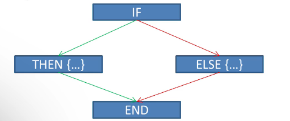
Basado en el ejemplo, se puede estudiar el uso de una sentencia condicional "IF". Se puede identificar qué operaciones se realizan en la cláusula "THEN" o en la cláusula "ELSE".
- En cuanto a la técnica **dinámica**
  - Analizar el sistema en tiempo de ejecución.
  - Facilita la identificación de dependencias
  - Facilita encontrar el código muerto.

Hay que tener en cuenta que algunos de estos programas también podrían identificarse aplicando una técnica estática, pero puede ser tedioso, porque implicaría un análisis muy detallado de código. Además, hay dependencias y código muerto que se pueden descubrir en tiempo de ejecución, como los que dependen del estado del sistema o de factores contextuales.

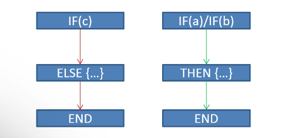

El ejemplo propuesto muestra que realizar ingeniería inversa dinámica en una sentencia condicional "IF" implicaría la especificación de un parámetro de entrada. Si introducimos los parámetros de entrada "a" y "b", la cláusula "THEN" se ejecutará. Por el contrario, al introducir el parámetro de entrada "c", se ejecuta la cláusula "else". Podemos observar que, frente a la técnica estática, la dinámica facilita la identificación rápida de las rutas de ejecución.

### Cuestiones legales

Las cuestiones legales de la ingeniería inversa no se pueden dejar de lado.

Es una técnica legal pero se deben considerar algunas limitaciones:

- Por un lado, está prohibido si la licencia lo indica.
- Por otro lado, está prohibida la difusión de herramientas (creadas gracias a esta técnica) que pueden romper medidas de seguridad que se hayan establecido.

Sin embargo, el uso de la ingeniería inversa difiere de un país a otro, aunque los temas mencionados son generales.

Por ejemplo, en España, la ingeniería inversa está permitida con fines de interoperabilidad, pero solo si no hay una forma más sencilla de lograrlo. Se han adoptado enfoques similares en países como Reino Unido o en Japón.

En resumen, teniendo en cuenta las leyes, debemos ser sensibles a la hora de hacer ingeniería inversa. El hecho de ser ético o poco ético es un tema controvertido y no hay una respuesta común. Lo importante es saber que la ingeniería inversa proporciona beneficios como facilitar la interoperabilidad, pero esta técnica, como muchas otras, en manos de usuarios ilegítimos puede convertirse en un gran problema de seguridad. Por lo tanto... ¡Cuidado! Hacer ingeniería inversa de un programa no siempre está permitido.

La ingeniería inversa tiene múltiples usos, pero en cualquiera de ellos, su objetivo es el estudio del funcionamiento interno de un sistema, bien sea a nivel físico o software. Es conveniente tener en cuenta que, aunque no es algo lícito en todos los casos, hay ocasiones en las que las empresas pueden integrar esta técnica para la mejora de sus productos.

## Descripción de la memoria del ordenador

Necesitamos entender cómo es la memoria de un ordenador par entender de qué forma se ejecutan los programas en memoria.

Los ordenadores almacenan en la memoria todos los programas mientras se ejecutan. Un análisis de memoria es esencial para comprender cómo funcionan los programas cuando el código no está disponible. 

La estructura de la memoria de un programa en C se representa aquí.

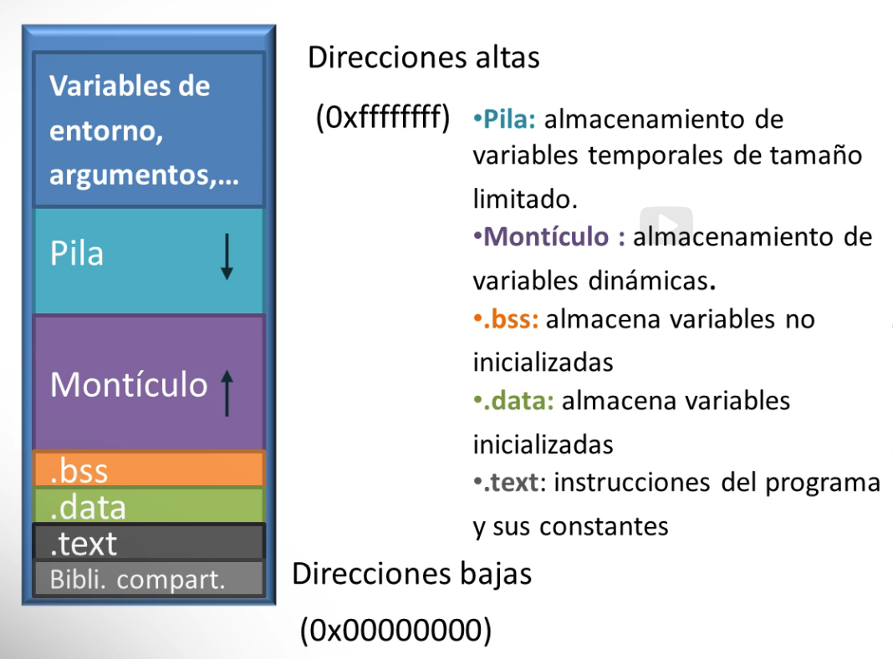

La memoria se divide en segmentos que tienen diferentes propósitos. En este curso, cuando presentamos una imagen de memoria, asumiremos que las direcciones de memoria altas están en la parte superior y las direcciones de memoria baja en la parte inferior. Pero, esto es solo una convención.

- En la parte superior, se ubican las variables de entorno y los argumentos.
- Luego, se coloca la pila (_stack_), es un espacio variable que crece de direcciones altas a direcciones bajas.
  - Se encarga de almacenar variables de tamaño limitado.
  - Almacena los cambios de contexto cada vez que el programa llama a una función o vuelve desde una función
- El siguiente segmento se corresponde con el montículo (_heap_), que crece en la dirección opuesta a la pila (de direcciones bajas a las altas).
  - Almacena variables dinámicas (cuyos tamaños tienen que reservarse).
- Otro segmento se llama _.bss_ en el que se almacenan todas las variables no inicializadas.
- Por el contrario, el segmento _.data_ almacena las variables inicializadas.
- Finalmente, en el último segmento, _.text_, se almacenan las instrucciones del programa y sus constantes. En otras palabras, en este último segmento se encuentra el código a ejecutar.
 
Con esto en mente, hay que resaltar la importancia de la pila y el montículo, como las partes más relevantes de la memoria de un ordenador para realizar ingeniería inversa.

Aquí podemos identificar algunos pequeños programas en C que manejan variables inicializadas y no inicializadas:

```c
#include <stdio.h>
char var [] = "hellowhowareyou";
int main(){
    int a = 76;
    return 0;
}
```

En este primer ejemplo, las variables "var" y "a" se inicializan y, por lo tanto, se almacenan en el segmento _.data._

```c
#include <stdio.h>
char buff;
int main(){
    int b;
    return 0;
}
```

Por el contrario, este ejemplo muestra las variables "buf" y "b" que no se inicializan y se ubican en el segmento _.bss._

```c
#include <stdio.h>
int main() {
    char * var = (char *) malloc (sizeof (char) * n);
    # mas código, cuando terminamos de usar la memoria, la liberamos
    free(var);
    # mas codigo
    return 0;
}
```

Ahora se presenta el ejemplo que involucra al montículo. En este caso, la variable "var" reserva memoria para n caracteres. Como es una reserva dinámica de la memoria de almacenamiento dinámico, no podemos olvidar liberar esa memoria, es decir, llamar a la función **free**, de lo contrario, la memoria en el almacenamiento dinámico permanecerá reservada y puede producir problemas en algún momento.

En la pila se llevan a cabo dos operaciones principales, **PUSH** y **POP**. La operación PUSH consiste en almacenar algo en la pila, mientras que la operación POP hace lo contrario. Nuevamente, es importante identificar la dirección de crecimiento de la pila. PUSH coloca elementos en la parte superior de la pila, mientras que POP recupera elementos también desde la parte superior. Si hacemos PUSH de los elementos 1, 2, 3 y 4, se ubican en orden inverso, es decir, el elemento 1 se ubica en las direcciones de memoria más altas y 4 en las direcciones más bajas. Como resultado, el comportamiento de la pila sigue la estrategia **LIFO**, _Last In First Out_, el último que llega es el primero en salir.

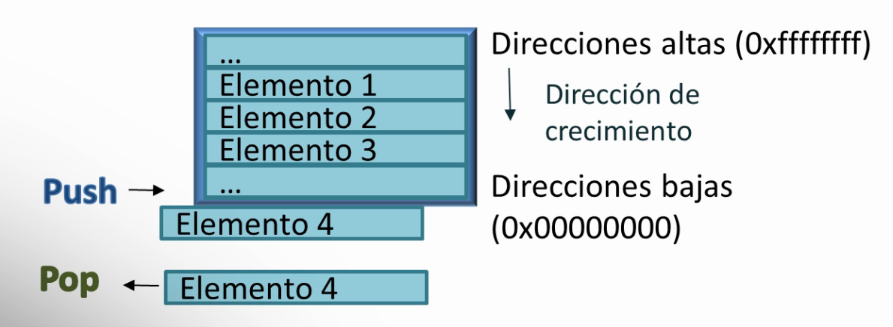

Aquí tenemos un ejemplo de un pequeño código que realiza una suma de un par de números:

```c
#include <stdio.h>

int sumar (int a, int b) {
    return (a+b);
}

int main() {
    int a = 1;
    int b = 2;

    returno sumar(a,b);
}
```

Como se llama a la función "sumar", los argumentos de esta función se almacenan en la pila para posteriormente realizar la operación de suma.

### La pila (stack)

Ahora que tenemos las nociones básicas sobre qué es y cómo funciona la memoria de un ordenador, vamos a dar un paso adelante para estudiar cómo funcionan los programas en memoria. En particular, aquí nos enfocamos en cómo los programas usan la pila.

Se realiza un cambio de contexto cuando un programa se mueve de una función a otra.

En el ejemplo propuesto, la función "sumar" se llama desde la función "main". Luego, cuando se ejecuta la función "sumar", se produce un cambio de contexto.

Antes de presentar cómo funciona la pila, se deben recordar dos conceptos:

- La pila almacena variables temporales de tamaño limitado cuando se ejecutan los programas.
- Un programa se divide en diferentes instrucciones y se almacenan en diferentes direcciones de memoria.

Con estos conceptos en mente, vamos a explicar el contenido de la pila. Cada función tiene una parte privada de la pila. Esta está delimitada por dos punteros:

- **EBP**, que apunta a la base,
- **ESP**, que apunta a la parte superior de la pila.

1. Al principio, en las direcciones altas de la memoria se encuentran los argumentos.
2. Posteriormente, cuando se realiza un cambio de contexto, se almacenan el EIP y el EBP almacenado:

    - El EIP se refiere al contador de programa, es decir, al registro que almacena la dirección de la siguiente instrucción que se ejecutará.
    - El EBP almacenado se refiere a la dirección de memoria del EBP antes del cambio de contexto.

3. Ambos valores se restauran después de realizar el cambio de contexto, es decir, cuando finaliza la función llamada.

El almacenamiento de ambos elementos es esencial para continuar ejecutando el código después de finalizar ese cambio de contexto:

- Se necesita EIP porque tenemos que saber qué instrucción de programa se debe ejecutar a continuación, es decir, el punto en el que se encontraba el programa antes de llamar a la función.
- Se necesita EBP almacenado para volver a la parte de la pila de la función que se ha llamado.

Tratando de entender más claramente cómo funciona la pila, vamos a ver un ejemplo.

En este programa en C que tiene una función principal en la que se llama a otra función, "sumar", y se proporcionan un par de parámetros para esta función. Suponemos que esta función "sumar" comienza a ejecutarse, en la línea 6 la pila se ve como en la imagen. En la parte superior de la pila se almacenan los argumentos de la función "sumar" (recuerda, en orden inverso, primero a y segundo b).

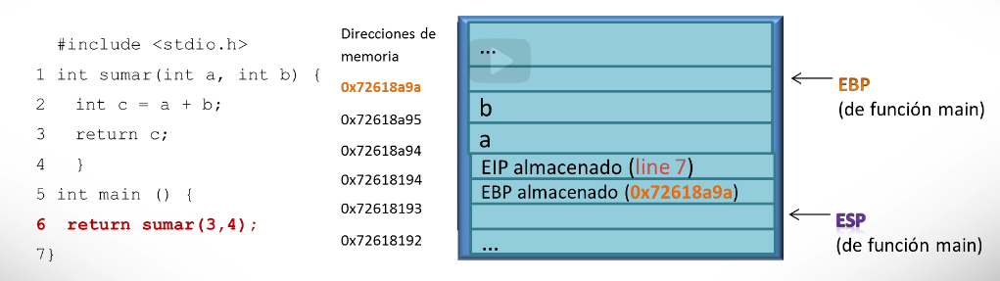

 Luego, se ubican EIP y EBP almacenado. En este momento, EBP y ESP apuntan a la base y la parte superior de la pila, respectivamente, de la función principal, la función "main". Ahora, suponemos que la línea 3 se está ejecutando y el estado de la pila se presenta en la imagen.

La variable "c" se almacena en el registro eax y EBP y ESP apuntan a la base y a la parte superior de la pila, respectivamente, de la función "sumar".

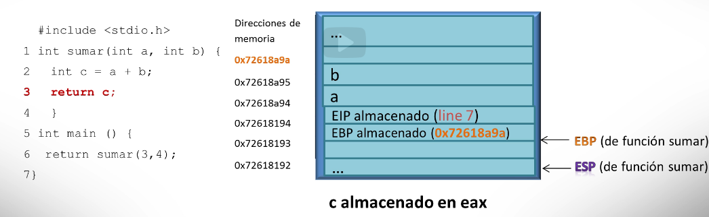

Cuando finaliza la función "sumar", es obligatorio volver a la función principal, a la función "main". Para hacerlo, el EIP guardado, almacenado, informa sobre la siguiente instrucción de programa a ejecutar (línea 6) y el EBP almacenado informa sobre la ubicación de la memoria de la base de la pila para la función "main".

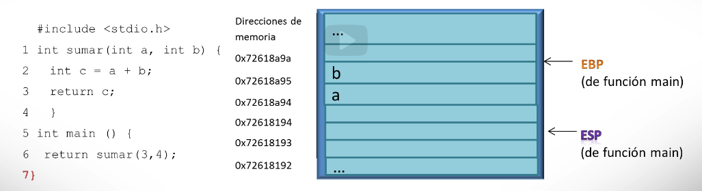

Por último, el programa termina. Con este pequeño ejemplo, se muestra que el proceso de cambio de contexto podría anidarse tantas veces como sea necesario.

### Memoria y registros (arquitectura x86)

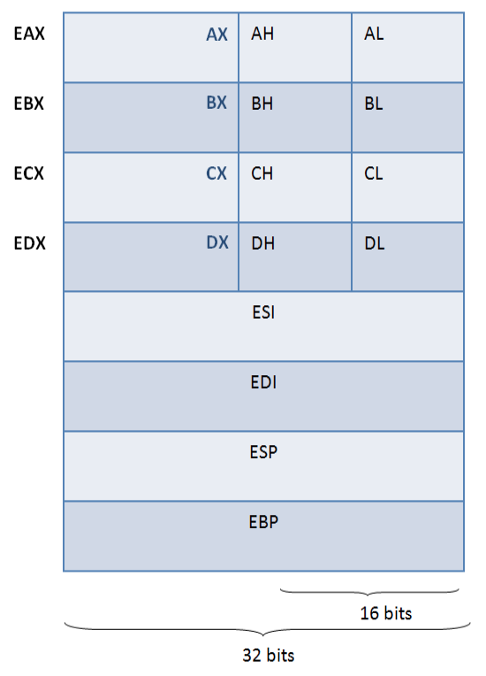

Definiciones:

- EAX: Acumulador, en este registro se realizan, especialmente, cálculos como sumas y restas. En genera, en este registro se realiza tanto trabajo como sea posible.
  - Se divide en 3 partes
    - AX: sólo usa la parte inferior de EAX
    - AH: sólo usa la mitad superior de AX
    - AL: sólo usa la mitad inferior de AX
- EBX: Registro base, se utiliza para almacenamiento adicional (cálculos, pero si función concreta)
  - Se divide en 3 partes:
    - BX: Solo considera la mitad inferior de EBX
    - BH: sólo usa la mitad superior de BX
    - BL: Sólo usa la mitad inferior de BX
- ECX: Registro controlador, se usa para contar instrucciones y para operaciones de desplazamiento de bits
  - Se divide en 3 partes:
    - CX: Solo considera la mitad inferior de ECX
    - CH: sólo usa la mitad superior de CX
    - CL: Sólo usa la mitad inferior de CX
- EDX: Registro de datos, su uso está muy relacionado con EAX.
  - Algunas instrucciones, como las multiplicaciones, que trabajan con datos grandes, almacenan parte de sus datos en este rgistro.
  - También se usa para instruccones IO, per su uso más común está relacionado con los cálculos sque involucran EAX.
  - Se divide en 3 partes:
    - DX: Considera la parte inferior de EDX
    - DH: Considera la parte superior de DX
    - DL: Considara la parte inferior de DX
- ESI: Indice de origen: los datos generados en los bucles tiene que ser almacenados en meoria, se necesita un origen y un destiono para esos datos. En este caso este registro se usa como origen.
- EDI: Indice de destino: los datos generados en los bucles tienen que ser almacenados en memoria; se necesita un origen y un destino para estos datos. En este caso este registro se utiliza como destino.
- ESP: Puntero de la pila: este registro apunta a la parte superior de la pila, es decir, apunta a las posiciones más bajas de memoria en la pila.
- EBP: Puntero base de la pila: este registro apunta a la parte inferior de la pila, es decir, apunta a las posiciones más altas de memoria en la pila.

## Descompilar y desensamblar

Decompilar y desensamblar son un par de técnicas de ingeniería inversa muy conocidas. Son diferentes formas de realizar ingeniería inversa y presentan tanto beneficios como inconvenientes.

Imagina que tienes una calculadora y quieres saber: primero, cuáles son las operaciones proporcionadas por la calculadora y segundo, cómo se realizan internamente las operaciones proporcionadas. El primer problema se puede comparar con un decompilador. Funciona a alto nivel y te da una visión general del elemento en juego. Sin embargo, el segundo problema, identificar cómo funciona internamente una calculadora puede compararse con un desensamblador porque intentas comprender, a un nivel muy bajo, cómo realiza las operaciones la calculadora.

Desensamblar y decompilar son las técnicas de ingeniería inversa más conocidas. Varios autores mencionan otras, como son los depuradores o "debuggers", que permiten el análisis de código en tiempo de ejecución, pero no son el foco de esta lección.

Los **decompiladores** se utilizan para traducir el código binario al código fuente. Este proceso es opuesto a compilar un programa. Por ejemplo, en Java cuando compilamos un programa obtenemos ficheros .class. Por tanto, al decompilar obtenemos ficheros .java. Sin embargo, la decompilación puede no ser siempre exitosa porque el código binario puede ofuscarse.

Aquí tenemos un ejemplo de un código Javascript que ha sido ofuscado.

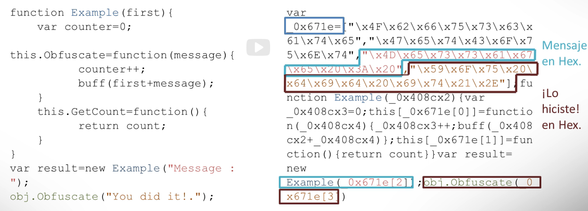

Cuando el código se decompile, la identificación del código fuente original es más compleja. 

Por ejemplo, se puede ver que una matriz llamada _x0671e se inicializa primero y contiene en la posición 2 la cadena "Mensaje:" y en la última posición la cadena "¡Lo hiciste!". Pero lo importante es que la ofuscación oculta la estructura real y el significado del código para dificultar el trabajo de alguien que la decompile.

La ofuscación se puede realizar mediante diferentes procedimientos:

- Eliminar saltos de línea
- Cambiar nombres de variables
- Reorganizar el código.

La aplicación de una técnica u otra depende de las capacidades de las herramientas que se estén utilizando.

A diferencia de un decompilador, un **desensamblador** traduce el código binario a código en ensamblador.

Presentado en este ejemplo, un programa que suma un par de números se puede desensamblar para obtener el código en ensamblador.

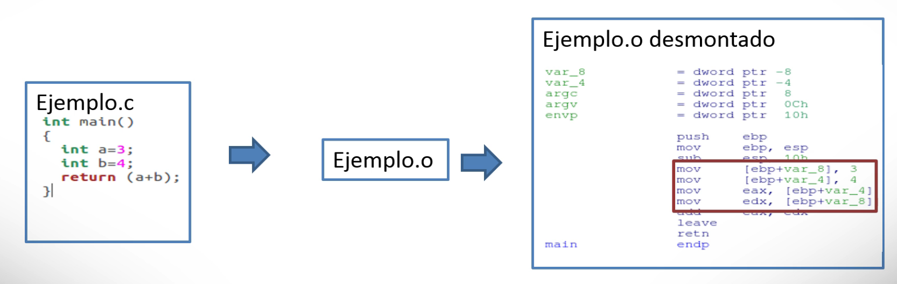

Presentado en la imagen, podemos identificar que el valor 3 se almacena en la ubicación de memoria _ebp + var\_8_ y 4 se almacena en la ubicación _ebp + \_var4_ para posteriormente almacenar estos valores en _edx_ y _eax_ respectivamente y ser finalmente sumados.

En el futuro estudiaremos el código en ensamblador con más detalle. pero, ¡cuidado! la ofuscación también puede afectar al código en ensamblador y, como en el caso de la decompilación, un código en ensamblador ofuscado puede ser realmente difícil de entender.

### Diferencias entre decompilar y desensamblar

Mientras que el primero traduce del código binario a código a alto nivel, el segundo traduce del código binario a código de bajo nivel. Como desarrollador, la decompilación produce resultados más comprensibles y, aunque se requiere experiencia, no tanta como para comprender el código desensamblado.

Entender el código decompilado implica conocer el lenguaje de programación utilizado, mientras que entender el código en ensamblador requiere experiencia en programación a bajo nivel, por eso es más difícil.

Como observación final, no olvides utilizar tanto la decompilación como el desensamblado para luchar contra la ofuscación. A veces, la decompilación conducirá a mejores resultados; otras, será al revés. Por lo tanto, ¡prueba ambas técnicas!

Los decompiladores son distintos para cada lenguaje.

Aquí tratamos:

- JD para java <http://java-decompiler.github.io/>. Coje un .class y lo pasa a .java
- Boomerang para C (incluye un desensamblador) <http://boomerang.sourceforge.net/>. coje el .o y lo pasa a .c o a ensamblador, según necesitemos
  - <https://github.com/BoomerangDecompiler/boomerang>

## Desensamblador

Sabemos que los programas en la memoria del ordenador se dividen en instrucciones en ensamblador.

### Instrucciones de ensamblador (x86)

Nos centramos en las instrucciones de Intel, pero son bastante similares en otros procesadores <https://es.wikipedia.org/wiki/Anexo:Instrucciones_x86>.

#### Manejo de la memoria

- **mov** consiste en mover un elemento de un registro o ubicación en memoria a otro.
  - `mov eax, [45]`: significa que la referencia de memoria de 45 se almacena en eax.
  - `mov eax, 45`: significa que el número 45 se almacena en eax.
- Instrucciones de pila: **push** y **pop** que almacenan y eliminan elementos de la pila respectivamente.
  - `pop [eax]`:  significa que el elemento ubicado en la parte superior de la pila es poped, quiere decir cogido, eliminado por así decirlo. Y se almacena en la memoria comenzando en la ubicación eax.
  - `push eax`: significa que eax es push, introducido, en la pila.

#### Instrucciones aritméticas

- Las operaciones aritméticas principales son suma (**add**), resta (**sub**), multiplicación (**imul**) y división (**idiv**). La forma en que se gestionan es muy similar.
  - `add eax, 10`: Se suma 10 al contenido del registro eax y el resultado se almacena en eax.
  - `mul esi, edi, 25`:El contenido de edi se multiplica por 25 y el resultado se deja en esi.
  - `mul eax, [var]`: significa que el contenido de eax se multiplica por el contenido de la ubicación de memoria "var" y el resultado se deja en eax.

#### Operadores lógicos

- AND, OR y XOR se aplican sobre un par de elementos.
  - `AND eax, ebx` significa que se realiza una operación AND entre el contenido de eax y ebx y el resultado también se deja en el registro eax.or el contrario, el operador lógico 
- NOT solo requiere un elemento.
  - `not [var]`: todos los bits del contenido de la ubicación de memoria "var" se niegan.

#### Condicionales y saltos

Comúnmente aplicadas cuando se programa. Se usan habitualmente sentencias condicionales como IF, WHILE, FOR (ojo, que en ensamblador no se distingue entre un WHILE y un FOR)...

Una sentencia condicional se compone principalmente de un par de instrucciones.

1. Una instrucción de comparación, como `cmp eax, 22`, lo que significa que 22 se compara con el contenido de eax.
2. Un instrucción de salto (a una etiqueta **label**) si se cumple cierta condicion
3. Si no se cumple, sigue el flujo normal

Por tanto, una de las instrucciones presentadas se ejecuta saltando al código de la sección "label" (etiqueta). Por ejemplo, la etiqueta “je” se aplica cuando se evalúa una condición igual (jump if equal), de modo que cuando el contenido de eax es igual a 22 se ejecuta la instrucción je. En el código adjunto puede corresponder a una sentencia IF con una declaración igual que expresa que "si es igual a 22, entonces se imprime hola". Las condiciones menores o mayores también son posibles alternativas, por ejemplo, la instrucción jng label se ejecuta para evaluar si el contenido de eax es menor que 22 (jump if no greater than) y, de ser así, hay un salto al código de la sección "label".

Una última posibilidad es el uso de la instrucción "jump label", lo que significa que se realiza un salto inmediato. Corresponde a un salto incondicional. Por ejemplo, `jump eax` significa que hay un salto al valor almacenado en el registro eax.

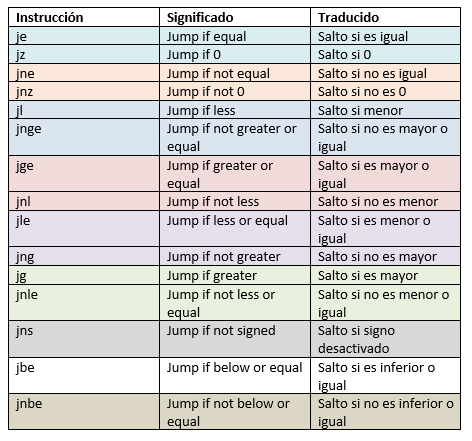

Un flag de un ordenador es un indicador booleano ("sí" o "no") utilizado para representar el estado de algo. Por ejemplo, si un valor dado es negativo o cero. Un uso común de los flags es cuando aparecen instrucciones de salto condicionales. El salto se realizará según el estado de los flags. Sin embargo, por simplicidad, no nos vamos a centrar en los flags, sino en el resumen general del siguiente par de instrucciones, TEST y CMP, en las que estamos interesados.

- **TEST operando1, operando2**: realiza una operación AND lógica y el resultado se deja en operando1.
- **CMP operando1, operando2**: realiza una operación de comparación y el resultado se deja en operando1.

Por ejemplo:

```text
test operando1, operando2   o   cmp operando1, operando2
jz    label      ; salto si operando1 es cero.
js    label      ; salto si operando1 es negativo.
jns   label     ; salto si operando1 es positivo.
```

### Desensamblador: IDAPro y ODA

Hay múltiples desensambladores. En este curso, se utilizará IDAPro porque ofrece potentes funciones de desensamblaje. Sin embargo, otros desensambladores como ODA están disponibles por si tuvieses problemas de instalación. Aquí encontrarás cómo instalar IDAPro, así como el proceso para acceder y preparar ODA para su uso.

#### IDAPro

IDAPro está disponible para las plataformas Windows, Linux e iOS. El programa se puede descargar desde: <https://www.hex-rays.com/products/ida/support/download_freeware/>

- Windows e iOS: Se proporciona un archivo ejecutable. Primero hay que instalarlo y luego cargarlo. Ten en cuenta que Python y bosh debugger deben estar instalados y pueden descargarse desde:

  - <https://www.python.org/downloads/>
  - <http://bochs.sourceforge.net/getcurrent.html>

  Este proceso puede ser tedioso y se pueden dar problemas de incompatibilidad con respecto a los procesadores. Por lo tanto, se recomienda trabajar con la versión de Linux.

- Linux: Descarga la carpeta .tgz, descomprímela y ejecuta el fichero “ida” con ./ida nombreFichero. (Por ejemplo: `./ida addition.o`)
  - Distribucones basadas en Debian:

  ```console
  sudo dpkg --add-architecture i386
  sudo apt-get update
  sudo apt-get install libc6-i686:i386 \
    libexpat1:i386 \
    libffi6:i386 \
    libfontconfig1:i386 \
    libfreetype6:i386 \
    libgcc1:i386 \
    libglib2.0-0:i386 \
    libice6:i386 \
    libpcre3:i386 \
    libpng12-0:i386 \
    libsm6:i386 \
    libstdc++6:i386 \
    libuuid1:i386 \
    libx11-6:i386 \
    libxau6:i386 \
    libxcb1:i386 \
    libxdmcp6:i386 \
    libxext6:i386 \
    libxrender1:i386 \
    zlib1g:i386 \
    libx11-xcb1:i386 \
    libdbus-1-3:i386 \
    libxi6:i386 \
    libsm6:i386 \
    libcurl3:i38
  ```

#### ODA, desensamblador en línea

Un programa en C también se puede desensamblar en línea, utilizando el desensamblador ODA: <https://onlinedisassembler.com>

Para desensamblar un código dado, sigue las siguientes instrucciones:

1. En el menú superior, haz clic en File >> Upload File.
2. Elige el archivo para cargar y haz clic en "Ok".
3. Identifica que, por defecto, el campo "Arch" ha tomado el valor "i386", si no, selecciona este valor.
4. Identifica que, por defecto, el campo "Base Address" ha tomado el valor "0x00000000", si no, selecciona este valor. Haz clic en “Ok”.

Recuerda que IDApro es una herramienta mucho más potente que ODA.
