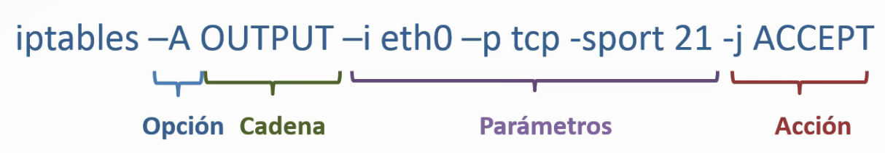
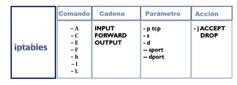

# Guía de comandos útiles

## Herramientas forenses

- **exiftool:** Herramienta para obtener metadatos de cualquier archivo:
  - Uso básico: `exiftool <archivo>`
  - Mas usos: `man exiftool`
  - Link: <https://exiftool.org/>
- **xdd:** muestra en hexadecima el fichero de entrada o bien convierte a hexadecimal el binario que se le pasa.
  - Útil para comprobar cabeceras y pies de ficheros, que nos permitirá reconocer el tipo de fichero.
  - Cabeceras más comunes: (un listado más exhaustivo en: <https://en.wikipedia.org/wiki/List_of_file_signatures>)
    
  - Uso: `man xxd`
  - Hermanos: `uuencode`, `uudecode`
  - Usado junto con un tcpdump puede ser útil
- **scalpel** File Carving (recuperación de ficheros): <https://github.com/machn1k/Scalpel-2.0 >
  - Para recuperar ficheros: `scalpel -c scalpel.conf -o <dir_salida> <disp_a_recuperar>`
  - Uso: `man scalpel`
  - en `scalpel.conf` se configuran las reglas o patrones para identificar cabeceras y piés de ficheros
  - Podemos ir comentando/descomentado las líneas del fichero de configuración en función de lo que queramos recuperar.
- **Volcado de RAM**
  - **Volatility** Un framework forense escrito en Python, tanto para windows, linux, android u OsX
    -  <https://www.volatilityfoundation.org>
    -  <https://github.com/volatilityfoundation/volatility>
  - Siempre podremos hacer un volcado con dd: (controlar que el tamaño del fichero de salida no sea mayor que la RAM que tenemos)
    - `dd if=/dev/mem of=volcado.mem bs=1M`
    - `dd if=/proc/kcore of=volcado.mem`
- **Autopsy**: <http://sleuthkit.org/autopsy>
  - Plataforma digital forense con un montón de herramientas forenses digitales.
  - Una vez instalado, todas las herramientas están accesibles ejecutando `$PATH_INSTALACION/bin/autopsy`
- **Análisis de ejecutables**
  - `ldd programa`: Lista de librerías de las que depende un programa
  - `strace ./programa`: Muestra las llamadas al sistema y las señales que usa un programa durante su ejecución
  - `readelf -a ./programa`: Muestra información del contenido de un fichero en formato ELF

## Firewall - IPTABLES

<https://help.ubuntu.com/community/IptablesHowTo>

Iptables es un cortafuegos de Linux utilizado por muchas personas en todo el mundo. Se basa principalmente en el filtrado de paquetes.

Iptables funciona con reglas compuestas de cuatro partes, como se muestra en el siguiente ejemplo.

Las reglas para el filtrado de paquetes se ponen en funcionamiento ejecutando el comando iptables. Con frecuencia se utilizan los siguientes parámetros del paquete como criterio:

- **Tipo de paquete**: especifica el tipo de paquetes que el comando filtra.
- **Origen/destino del paquete**: especifica qué paquetes filtra el comando según el origen o el destino del mismo.
- **Acción**: especifica qué acción se toma en los paquetes que coinciden con los criterios anteriores.

Cuando necesites ayuda, `escribe iptables –h`

Una idea general de la estructura de comandos de Iptables se muestra en la Figura 2.

### Opciones de comando de iptables

Las opciones de comando indican a Iptables que realice una acción específica. Solo se permite una opción de comando por comando Iptables. Excepto el comando de ayuda, todos los comandos se escriben en mayúsculas.

Los comandos de iptables son los siguientes:

- `-A`: Añade la regla iptables al final de la cadena especificada. Este es el comando utilizado para simplemente añadir una regla cuando el orden de las reglas en la cadena no importa.
- `-C`: Comprueba una regla antes de añadirla a la cadena especificada por el usuario.
- `-E`: renombra una cadena definida por el usuario. Esto no afecta a la estructura de la tabla.
- `-F`: Libera la cadena seleccionada borrando las reglas incluidas en la misma. Si no se especifica ninguna cadena, este comando libera cada regla de cada cadena.
- `-h`: proporciona una lista de estructuras de comandos, así como un resumen rápido de los parámetros y opciones de comandos.
- `-I`: Inserta una regla en una cadena especificada por el usuario.
- `-L`: Lista todas las reglas de la cadena especificada tras el comando. Un ejemplo de esto se presenta en la Figura 3.

#### Cadenas iptables

- **INPUT**: modifica los paquetes de red destinados al equipo.
- **OUTPUT**: modifica los paquetes de red generados localmente antes de enviarlos.
- **FORWARD**: modifica los paquetes de red enrutados a través del equipo.

#### Parámetros de iptables

Una vez que se especifiquen ciertos comandos iptables, incluyendo aquellos para añadir, eliminar, insertar o reemplazar reglas dentro de una cadena, se requieren parámetros para construir una regla. Aquí mostramos algunos de los parámetros más utilizados:

- `-d`: Configura el nombre de la máquina destino, dirección IP o red de un paquete que coincide con la regla.
- `-i`: establece la interfaz de red entrante, como eth0 o ppp0.
- `-j`: realiza un objetivo de acción particular cuando un paquete coincide con una regla. Las acciones válidas para usar después de la opción `-j` incluyen opciones estándar (ACCEPT, DROP, QUEUE, and RETURN), así como opciones extendidas que están disponibles a través de módulos cargados por defecto.
- `-o`: establece la interfaz de red saliente para una regla y solo se puede usar con las cadenas OUTPUT y FORWARD. Estos parámetros son los mismos que aquellos de la interfaz de entrada (-i).
- `-p`: Configura el protocolo para la regla, el cual puede ser icmp, tcp, udp, o all. Además, se puede usar cualquier protocolo listado en `/etc/protocols`. Si esta opción es omitida cuando se está creando una regla, la opción all se escogerá por defecto.
- `-s`: Establece el origen de un paquete utilizando la misma sintaxis que el parámetro de destino (`-d`).
- `--dport`: Configura el puerto de destino para el paquete. Usa bien sea un nombre de servicio (tal como www o smtp), número de puerto, o el rango de números de puertos. Para ver a los nombres y alias de los servicios de red y los números de puerto que utilizan, puedes acceder al archivo /etc/services. La opción --destination-port es sinónimo de --dport. Para especificar un rango de números de puerto, separa los dos números con dos puntos `:`, como -p tcp --dport 3000: 3200. El rango más grande que puedes utilizar es 0:65535.
- `--sport`: Configura el puerto origen del paquete usando las mismas opciones que --dport. La opción --source-port match es sinónimo de --sport.
- `--icmp-type`: establece el nombre o el número del tipo ICMP para que coincida con la regla. Se puede recuperar una lista de nombres ICMP válidos escribiendo el comando `iptables -p icmp -h`
- `--limit`: establece el número de coincidencias para un rango de tiempo especificado, indicando un número y un modificador de tiempo con formato <number><time>. Por ejemplo, si usamos --limit 5/hour sólo dejaremos que una regla sea evaluada cinco veces a la hora. Si no se utiliza ningún número ni modificador de tiempo, se asume el siguiente valor por defecto: 3/hour.
- `--state`: hace coincidir un paquete con los siguientes estados de conexión: 
    - **ESTABLISHED**: El paquete coincidente está asociado con otros paquetes en una conexión establecida.
    - **INVALID**: El paquete coincidente no puede vincularse a una conexión conocida.
    - **NEW**: El paquete coincidente está creando una nueva conexión o es parte de una conexión bidireccional que no se había visto anteriormente.
    - **RELATED**: El paquete coincidente está iniciando una nueva conexión relacionada de alguna manera con una conexión existente.
- Estos estados de conexión se pueden usar conjuntamente, separándolos con comas, como `-m state –state NEW, ESTABLISHED`.

#### Acciones de iptables

Una vez que un paquete ha coincidido con una regla, la regla puede dirigir el paquete a un número de acciones diferentes. Cada cadena tiene una acción por defecto, la cual es usada si ninguna de las reglas en esa cadena coinciden con un paquete o si ninguna de las reglas que coinciden con el paquete especifica una acción.

Las siguientes son las principales acciones:

- **ACCEPT** — Permite que el paquete se mueva hacia su destino (o hacia otra cadena, si no ha sido configurado ningún destino).
- **DROP** — Deja caer el paquete sin responder al solicitante. El sistema que envía el paquete no es notificado de este fallo.

##### Acción de registro de iptables

Existen varias acciones además de las anteriores, la mayoría de los cuales tan sólo se aplican a tablas o situaciones específicas. Uno de los módulos de acción más utilizados y populares es el de LOG.

La acción LOG está especialmente diseñada para registrar información detallada sobre paquetes. Esta acción registra información sobre los paquetes, como la mayoría de los encabezados IP y otra información que se considere interesante.

- **LOG**: Registra todos los paquetes que coinciden con la regla. En el archivo `/etc/syslog.conf` se especifica dónde se escriben estas entradas de registro. Por defecto, se almacenan en el archivo `/var/log/messages`.

Se pueden usar varias opciones adicionales tras la acción LOG:

- `--log-level`: Configura el nivel de prioridad del registro de eventos. Una lista de los niveles de prioridad se puede encontrar en la página del manual de `syslog.conf`.
- `--log-ip-options`: Registra cualquier opción establecida en el encabezado de un paquete IP.
- `--log-prefix`: Coloca una cadena de hasta 29 caracteres antes de la línea de registro cuando se almacena.
- `--log-tcp-options`: Registra cualquier opción establecida en el encabezado de un paquete TCP.
- `--log-tcp-sequence`: Escribe el número de secuencia TCP del paquete en el registro.
